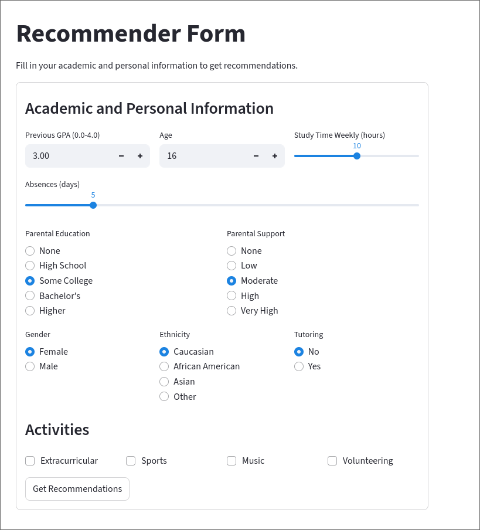
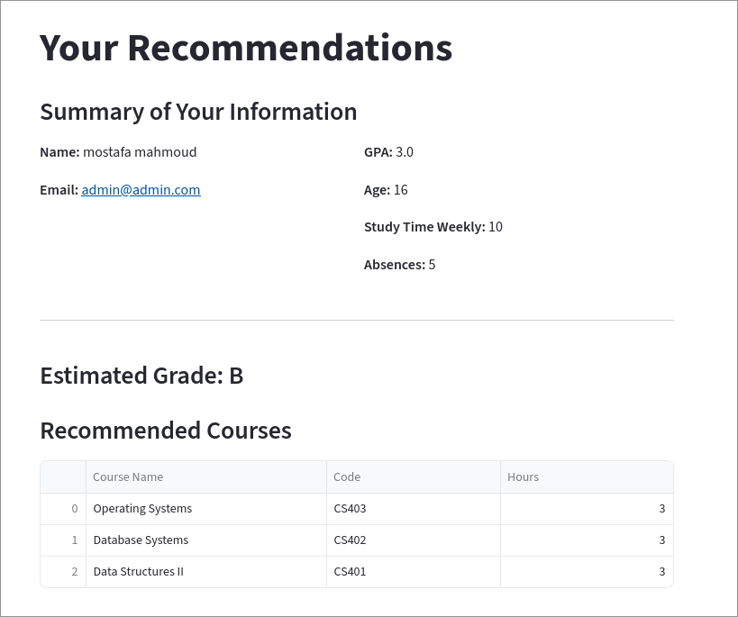
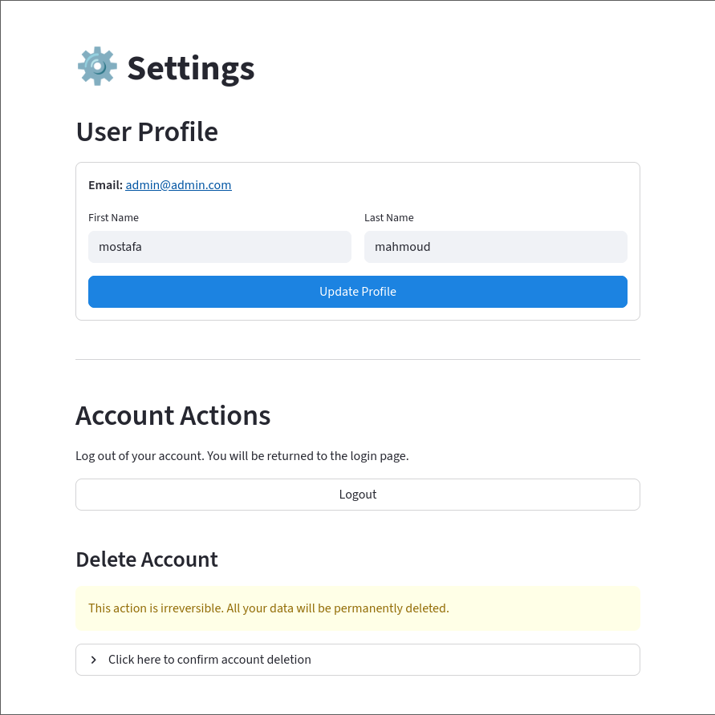
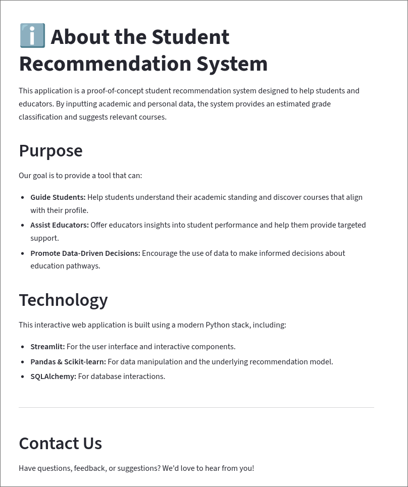
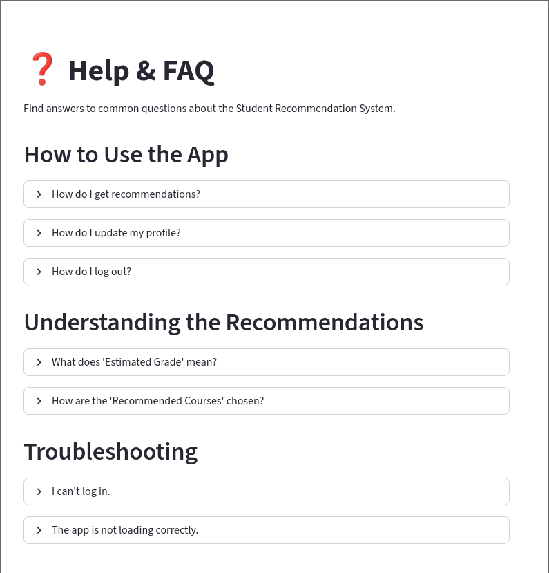

# Student Recommendation System

## Project Overview

This project implements a student recommendation system designed to assist students in selecting suitable courses based on their academic profile. The system features an interactive web-based user interface built with Gradio, allowing users to input their personal and academic information, and receive personalized course recommendations.

## Features

*   **Interactive User Interface:** A multi-page Gradio application guides users through the information submission process.
*   **User Information Collection:** Gathers basic student details including first name, last name, and email, with basic validation.
*   **Academic Information Collection:** Collects previous GPA and allows for dynamic entry of past courses and their grades.
*   **Personalized Course Recommendations:** Provides course recommendations based on the submitted academic profile (currently a placeholder logic based on GPA).
*   **Modular Architecture:** The codebase is structured into distinct modules for UI, data models, business logic, and utilities, promoting maintainability and scalability.

## Project Structure

```
project/
├── src/
│   ├── __init__.py
│   ├── ui/
│   │   ├── __init__.py
│   │   └── gradio_app.py  # Gradio UI components and interactions
│   ├── data/
│   │   ├── __init__.py
│   │   └── models.py     # Data models (e.g., User, Course)
│   ├── logic/
│   │   ├── __init__.py
│   │   └── recommender.py # Recommendation logic
│   └── utils/
│       ├── __init__.py
│       └── validation.py  # Input validation utilities
├── main.py             # Entry point for the application
├── pyproject.toml      # Project dependencies and metadata
├── README.md           # Project description and documentation
├── uv.lock             # Dependency lock file
├── assets/             # Directory for project assets (e.g., screenshots, diagrams)
└── .venv/              # Python virtual environment
```

## Usage

1.  **User Information:** Enter your first name, last name, and email address. The system will validate the email format. Click "Next".
2.  **Academic Information:** Provide your previous GPA (between 0.0 and 4.0). You can also add multiple courses you've taken along with their grades by entering the course name and grade, then clicking "Add Course".
3.  **Recommendations:** After submitting your academic information, the system will display a summary of your input and a list of recommended courses.

## UI

| Login Page | Signup Page |
| :---: | :---: |
|  |  |

| Form Page | Dashboard Page |
| :---: | :---: |
|  |  |

| Recommendations Page | Settings Page |
| :---: | :---: |
|  |  |

| About Page | FAQ Page |
| :---: | :---: |
|  |  |
